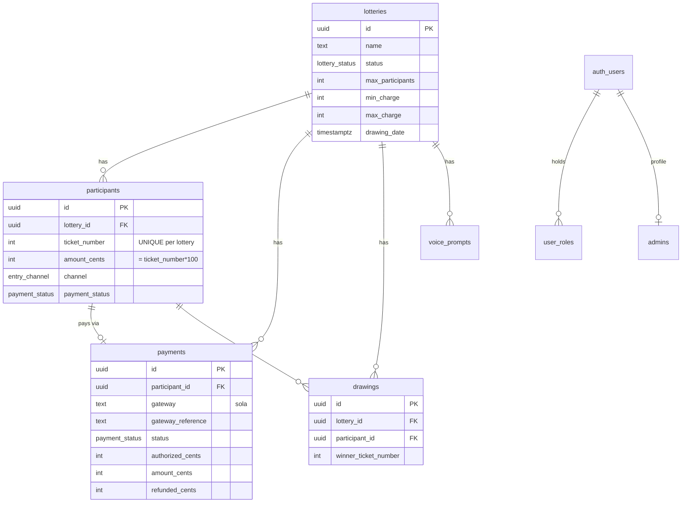

# Database Schema

All monetary values are stored as **integer cents**, except `ticket_number`
which is a whole-dollar integer that also equals the exact dollar charge
(ticket `#247` → `$247` → `amount_cents = 24700`).

## ERD

## Key constraints

- `UNIQUE (lottery_id, ticket_number)` on `participants` — the hard guarantee
  against double assignment. Assignment retries on conflict.
- `CHECK (amount_cents = ticket_number * 100)` — ticket/charge coupling.
- Soft deletes via `deleted_at` on core tables.
- RLS enabled + forced on `participants` and `payments`.

## Stored procedures

| Function | Purpose |
| --- | --- |
| `assign_ticket_and_record_payment(...)` | Atomically pick an unused ticket, create participant + payment. Run in a SERIALIZABLE tx. Auto-closes lottery when the final ticket is taken. |
| `draw_winner(lottery_id, drawn_by)` | Randomly select one SOLD ticket, record the drawing, mark lottery `completed`. Never picks an unsold ticket. |
| `lottery_stats(lottery_id)` | Aggregate revenue, counts, min/avg/max charge, channel split. |
| `has_role / has_any_role / is_admin` | RLS role helpers (SECURITY DEFINER). |

## Enums

- `lottery_status`: draft, open, paused, closed, completed
- `entry_channel`: phone, web
- `payment_status`: pending, authorized, captured, failed, voided, refunded, partially_refunded
- `app_role`: super_admin, lottery_manager, support, viewer

## Indexes

Foreign keys, timestamps, `status`, `payment_status`, `gateway_reference`,
`phone`, `(lottery_id, ticket_number)`. See `migrations/0002_indexes.sql`.

## Migrations

| File | Contents |
| --- | --- |
| `0001_initial_schema.sql` | Tables, enums, `updated_at` triggers |
| `0002_indexes.sql` | Performance indexes |
| `0003_functions.sql` | Business-logic stored procedures |
| `0004_storage_realtime.sql` | Storage buckets + realtime publication |
| `0005_rls.sql` | Row Level Security policies |
