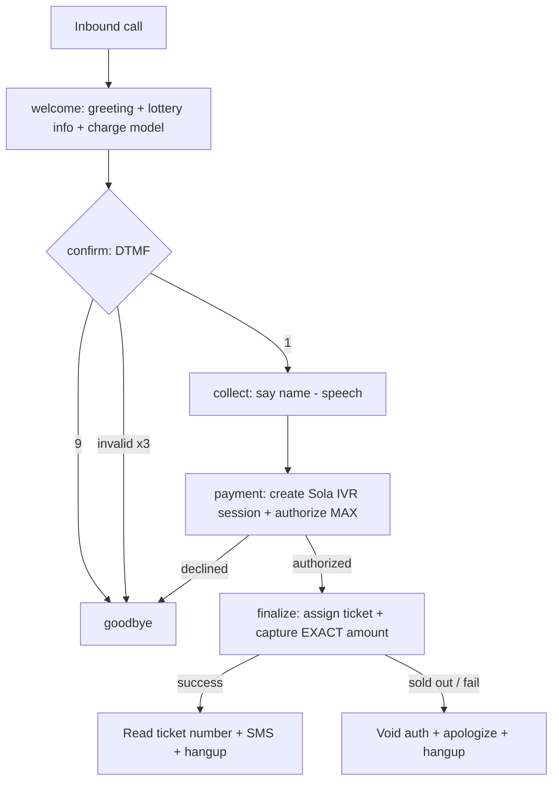

# SignalWire Voice Integration

The inbound phone number routes to the `signalwire-voice` Edge Function, which
returns **LaML** (TwiML-compatible) XML. The IVR is a state machine driven by a
`?step=` query parameter.

Phone number: **+1 (845) 935-7587** · Space: `accuinfo.signalwire.com`

## Call flow



## Steps

| Step | Behavior |
| --- | --- |
| `welcome` | Plays greeting, prize, charge-range explanation. Gathers 1 DTMF digit. Upserts a `call_logs` row keyed by `CallSid`. |
| `confirm` | `1` → continue, `9` → goodbye. Duplicate-phone guard. Re-prompts up to 3 times on invalid input. |
| `collect` | Captures caller name via speech; phone from caller ID. |
| `payment` | Creates a Sola IVR/agent-assist session, authorizes the **max** range amount. Stashes auth context on the call log. |
| `finalize` | Calls `finalizeEntry` → assigns unused ticket, captures the **exact** ticket amount, voids on failure. Reads ticket number back via TTS. |
| `goodbye` | Plays goodbye prompt and hangs up. |

## Prompt slots (voice_prompts table)

`welcome_greeting`, `lottery_explanation`, `payment_instructions`,
`confirmation_message`, `winner_announcement`, `goodbye_message`,
`error_message`, `support_message`. Each row is tagged with a `language` code
for multi-language support. `confirmation_message` supports `{{ticketNumber}}`
and `{{amountDollars}}` placeholders.

## Webhook configuration

In the SignalWire dashboard, set the phone number's **Voice** handler to:

```
POST  https://<project-ref>.supabase.co/functions/v1/signalwire-voice
```

Optionally set a status callback to a logging endpoint. Card data is captured by
Sola's PCI-compliant IVR — never by this function.

## Signature verification

Requests are verified with `verifySignalWireSignature` (HMAC-SHA1 over the URL +
sorted POST params using the API token). Enforce in production;
best-effort in local dev.

## Outbound SMS

Confirmation and winner messages are sent with `sendSms` via the SignalWire
Messaging API and logged to `sms_logs`.
