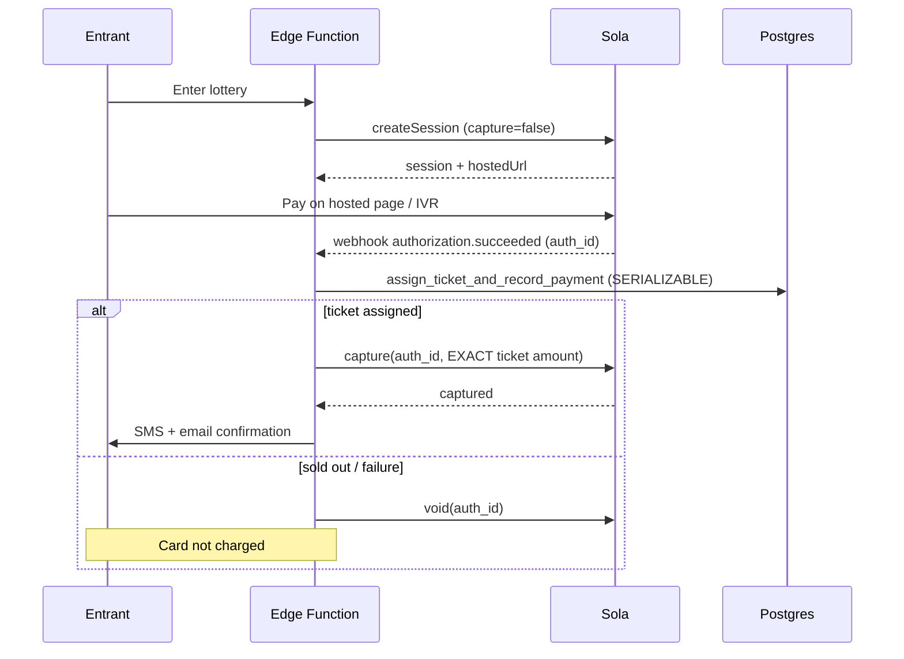

# Sola Payments Integration

Sola Payments (solapayments.com) is the **default** payment provider. All
payment logic goes through the [`PaymentGateway`](../supabase/functions/_shared/payment/gateway.ts)
interface; `SolaPaymentsGateway` is the concrete implementation. Swapping
providers requires only a new implementation + one line in `factory.ts`.

## Capabilities

| Operation | Method | Notes |
| --- | --- | --- |
| Create session | `createSession` | Hosted checkout (web) or IVR capture (phone). Pre-auth only. |
| Authorize | `authorizePayment` | Authorizes the **max** of the range. |
| Capture | `capturePayment` | Captures the **exact** ticket amount. |
| Void | `voidPayment` | Used when no ticket can be assigned. |
| Refund | `refundPayment` | Admin-initiated, full or partial. |
| Status | `getTransactionStatus` | Reconciliation. |
| Verify webhook | `verifyWebhookSignature` | HMAC-SHA256, constant-time compare. |

## Auth → Capture → Void flow



## PCI compliance

- **Web:** users are redirected to Sola's hosted checkout — the site never
  touches card data.
- **Phone:** Sola's PCI-compliant IVR/agent-assist captures the card.
- Tokenization only; raw PAN/CVV are **never** stored. `redact()` strips
  sensitive fields before any payload is persisted.

## Secrets (Edge Function only)

```
SOLA_API_KEY
SOLA_API_SECRET
SOLA_WEBHOOK_SECRET
SOLA_MERCHANT_ID
SOLA_ENVIRONMENT     # sandbox | production
SOLA_API_BASE_URL
```

Set them with:
```bash
supabase secrets set --env-file ./supabase/functions/.env
```

## Webhook setup

Point Sola webhooks to:
```
POST  https://<project-ref>.supabase.co/functions/v1/sola-webhook
```
Sola signs the raw body; the function verifies `x-sola-signature`
(`sha256=<hmac>`) and rejects invalid signatures with `401`. Processing is
idempotent per `session_id`, and every payload is stored in `webhook_logs`.

## Persisted payment fields

`gateway='sola'`, `gateway_reference`, `status`, `authorized_cents`,
`amount_cents`, `refunded_cents`, `settlement_status`, redacted `raw_response`,
timestamps. See `payments` in [SCHEMA.md](SCHEMA.md).
