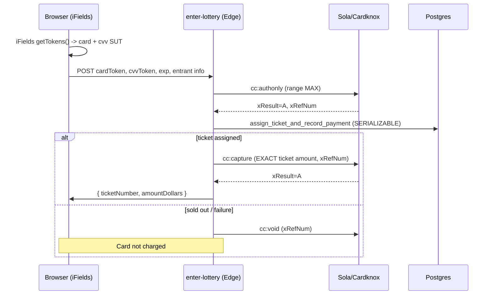

# Sola Payments Integration

Sola runs on the **Cardknox Transaction API** — a synchronous, `xKey`-authenticated
JSON API. **There are no card webhooks**; every operation returns its result in
the HTTP response. All payment logic goes through the
[`PaymentGateway`](../supabase/functions/_shared/payment/gateway.ts) interface;
`SolaPaymentsGateway` is the concrete implementation. Swapping providers requires
only a new implementation + one line in `factory.ts`.

## Endpoints & auth

- **Transaction API:** `POST https://x1.cardknox.com/gatewayjson` (x2/b1 are backups).
- **Auth:** `xKey` (your account/API key) sent in the request body — server-side only.
- **CORS:** browser requests are blocked, so all calls run from Edge Functions.

## Commands used

| Operation | `xCommand` | Notes |
| --- | --- | --- |
| Authorize | `cc:authonly` | Authorizes the range **MAX**; returns `xRefNum`. |
| Capture | `cc:capture` | Captures the **exact** ticket amount (`xAmount`, `xRefNum`). |
| Void | `cc:void` | Voids the auth when no ticket can be assigned. |
| Refund | `cc:refund` | Admin refund by `xRefNum`. |

Key response fields: `xResult` (`A`=approved, `D`=declined, `E`=error, `V`=3DS
challenge), `xRefNum`, `xAuthAmount`, `xToken`, `xError`, `xErrorCode`.

## Web card capture — iFields (client-side tokenization)

The website uses **iFields**: card number + CVV are entered in cross-origin
iframes served by Cardknox, which return **single-use tokens (SUT)**. Raw PAN/CVV
never touch our page or server.

- Public **iFields key** (separate from the API key) initializes the script:
  `VITE_SOLA_IFIELDS_KEY` (see [../frontend/src/lib/ifields.ts](../frontend/src/lib/ifields.ts)).
- `getTokens()` fills hidden inputs `xCardNum` (card SUT) and `xCVV` (CVV SUT).
- The frontend posts the SUTs + `exp` (MMYY) to `enter-lottery`, which sends the
  SUT as `xCardNum` to the Transaction API.

## Synchronous entry flow (web)



The **phone** flow (`signalwire-voice`) uses the same gateway: card digits are
collected via DTMF, sent to `cc:authonly`, then the ticket is assigned and the
exact amount captured — card digits are scrubbed from the transient call log
immediately after authorization.

## PCI notes

- **Web:** iFields keeps the site out of PCI scope (no raw card data).
- **Phone:** DTMF capture is a reference implementation; for production PCI
  reduction use Sola's PCI IVR / DTMF-suppression product.
- Responses are redacted before persistence (`redact()` in `sola.ts`); no
  PAN/CVV is ever stored. Only `xRefNum`/`xToken` are kept.

## Secrets

Server-side (Edge Function secret) — only one is required:

```
SOLA_API_KEY          # xKey (account key)
SOLA_ENVIRONMENT      # sandbox | production
SOLA_API_BASE_URL     # default https://x1.cardknox.com
```

Client-side (public, in the frontend build):

```
VITE_SOLA_IFIELDS_KEY       # iFields (public) key — NOT the API key
VITE_SOLA_IFIELDS_VERSION   # from https://cdn.cardknox.com/ifields/versions.htm
```

## Sandbox testing

Test cards (sandbox key): Visa `4444333322221111`, Mastercard `5454545454545454`,
Amex `370276000431054`. Amount `9.91` forces a decline; `9.92` a gateway error.
CVV `123`, any future expiry.
